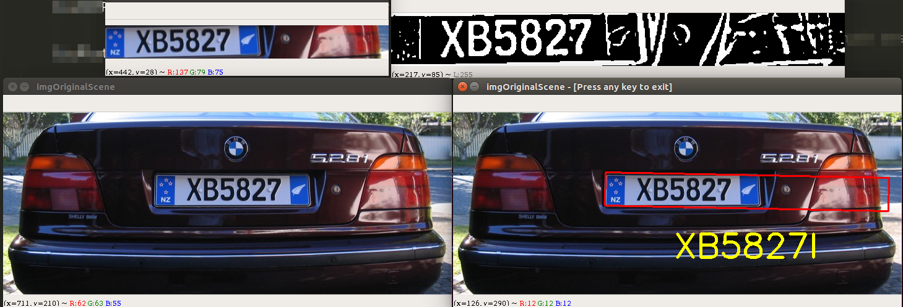

# License Plate Recognition

Using OpenCV 3 module for license plate recognition.

# Requirements

* Python 3+
* Pip 


# Install


```
pip install -r requirements.txt
```

# Running

```
python PlateRecognition.py plates/01.png
```

# Output



Press any key to exit.

Tested on Ubuntu 18.04

if you want retrain the KNN (Near Neighborhood) algorithm.
Recreating the files classifications.txt and flattened_images.txt using this repository 
[OpenCV 3 KNM Character Recognition Python](https://github.com/MicrocontrollersAndMore/OpenCV_3_KNN_Character_Recognition_Python)

```
python GenData.py
```


# References

[OpenCV](http://opencv-python-tutroals.readthedocs.io)

[OpenCV 3 License Plate Recognition Python](https://github.com/MicrocontrollersAndMore/OpenCV_3_License_Plate_Recognition_Python)

[OpenCV 3 KNM Character Recognition Python](https://github.com/MicrocontrollersAndMore/OpenCV_3_KNN_Character_Recognition_Python)
